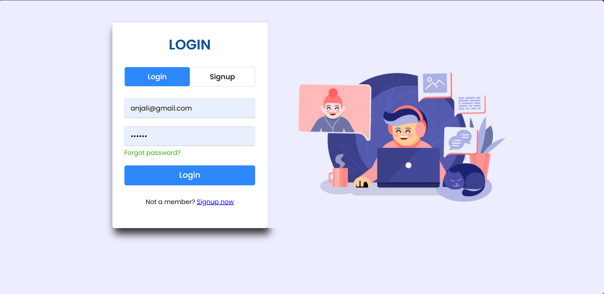

# GatherHub

## Introduction
GatherHub is a video chat application designed for seamless online communication, offering features similar to Zoom. It allows users to connect, collaborate, and communicate in real-time through video calls, chat messages, and more.

## Table of Contents
- [Team Members](#team-members)
- [Deployed App](#deployed-app)
- [Features](#features)
- [Tech Stack](#technology-stack)
- [Website Preview](#website-preview)

## Project Type
- Fullstack

## Team Members
The project was developed collaboratively by the following team members:

- **Mohd Khalid** -  fw28_112
- **Prity Rastogi** -  fw28_163
- **Shashank Singh** - fw28_270
- **Utkarsh Agnihotri** -  fw28_054
- **Kumari Anjali** - fw28_149

## Deployed App
- Frontend: https://gatherhub.netlify.app/
- Backend: https://hack-sorcerer.onrender.com/
 
## Technology Stack
Frontend:
- HTML
- CSS
- JavaScript

Backend:
- Node.js
- Express.js
- Socket.io
- WebSockets
- Nodemailer
- WebRTC

DataBase:
- MongoDB
- Redis

## Features

- Video Calls: Conduct high-quality video calls with multiple participants.
- Chat Messaging: Send text messages during video calls or separately.
- Screen Sharing: Share your screen to enhance collaboration and presentations.
- User Authentication: Secure user authentication and authorization mechanisms.
- Real-time Updates: Experience real-time updates for online/offline status, new messages, etc.
- Invite Friends: Invite others to join a call via email invitations.
- Responsive Design: Responsive UI to ensure seamless usage across devices.

## API Endpoints
In case of Backend Applications provide a list of your API endpoints, methods, brief descriptions, and examples of request/response.
GET /api/items - retrieve all items
POST /api/items - create a new item
POST /users/register - register the user
POST /users/login - login a user
GET /users/logout - logout the users
POST /calender/send-mail - to send the booked calender mail

## Installation & Getting started
Detailed instructions on how to install, configure, and get the project running. For BE/FS projects, guide the reviewer how to check mongodb schema etc.

```bash
npm init -y or yarn init -y
cd backend 
npm install or yarn install
npm run server  or yarn run server
```

## Website Preview
Here are some preview images of the website pages:


**Landing**


**Sign In**



**Dashboard**


**Main Room**


**Main Room**


The images provide a glimpse of the visually appealing and responsive website. Feel free to explore the deployed website to see the full design and functionality.
